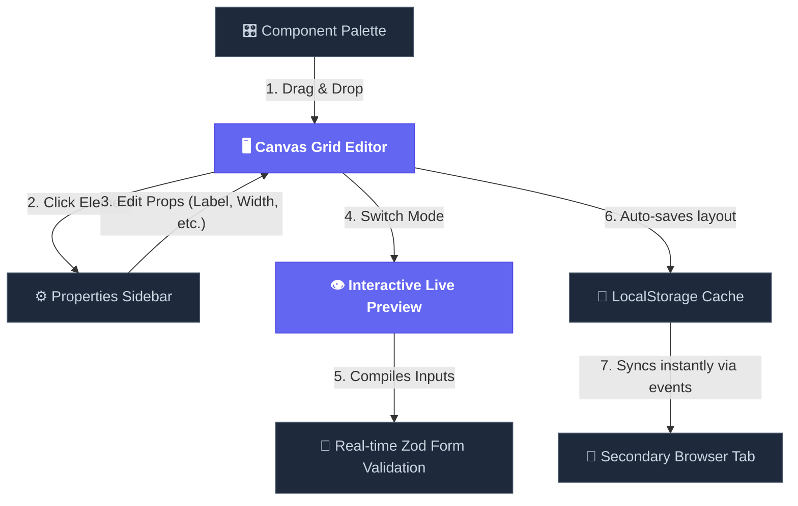

# ⚡ Low-Code Module Builder — Simple Presentation Guide

Welcome to the **Low-Code Module Builder** presentation guide! This document provides a straightforward, easy-to-understand explanation of the system's features, architecture, and core code engines.

---

## 🎨 1. High-Level System Flow

Here is a simple flow diagram showing how a developer interacts with the system, and how the builder synchronizes data behind the scenes:



---

## 🚀 2. Core Features Explained Simply

### 1. Drag & Drop Grid Layout
*   **What it does:** Drag components (Text, Inputs, Buttons, Tables, Forms) from the left sidebar onto the central canvas area.
*   **Side-by-Side Elements:** You can customize any component's width to **100% (Full)**, **50% (Half)**, or **33% (One-Third)**. Placing multiple half-width or one-third elements sequentially aligns them perfectly side-by-side!

### 2. Nestable Container drops (Forms)
*   **What it does:** You can drag a **Form Container** onto the canvas, and then drag **Input Fields** or **Buttons** directly *inside* it. This structures fields inside logical groups.
*   **Cascading Deletion:** If you delete a Form Container, it automatically cleans up and deletes all elements inside it, preventing orphaned nodes in memory.

### 3. Real-Time Cross-Tab Sync
*   **What it does:** Open the application in two side-by-side browser windows. Any edit, drag-and-drop, or reorder you perform in Tab 1 updates Tab 2 instantly without any manual reload!
*   **Why it is cool:** Simulates a live collaborative cloud environment using clean native browser storage channels.

### 4. Dynamic Form Validation Preview
*   **What it does:** Switch from "Editor" to "Live Preview" mode to test the screen. The engine automatically finds your form containers and child inputs, compiles a **Zod Validation Schema** on-the-fly, and validates user inputs when they submit the form.
*   **Interactive Tables:** The table component fetches live simulated user datasets so the preview looks like a fully populated real-world application dashboard.

### 5. Infinite Undo / Redo History
*   **What it does:** Supports reversing or re-applying actions via the toolbar buttons or using standard `Ctrl+Z` (Undo) and `Ctrl+Y` / `Ctrl+Shift+Z` (Redo) hotkeys.
*   **Smart Hotkeys:** The keyboard listener automatically ignores hotkeys when you are typing inside text fields, preventing conflicts with browser default copy-paste actions.

---

## 💻 3. Simple Code Highlights

Below are simplified explanations of the core code structures that power these advanced capabilities:

### A. The Dynamic Zod Validation Compiler
In Preview Mode, the engine transforms flat layout nodes into a schema-validated active form. Here is the simplified compiler logic:

```typescript
// Located in: src/components/Preview.tsx

// 1. Identify all child inputs inside a Form Container
const formInputs = nodes.filter(n => n.parentId === formId && n.type === 'input');

// 2. Generate a Zod Validation Object Schema dynamically
const schemaShape: Record<string, any> = {};

formInputs.forEach(input => {
  let fieldSchema = z.string();
  
  if (input.props.inputType === 'number') {
    // Coerce values to a number automatically
    fieldSchema = z.coerce.number();
  }
  
  if (input.props.required) {
    fieldSchema = fieldSchema.min(1, { message: `${input.props.label} is required` });
  } else {
    fieldSchema = fieldSchema.optional();
  }
  
  schemaShape[input.id] = fieldSchema;
});

const dynamicValidationSchema = z.object(schemaShape);
```

### B. Stable Cross-Tab Sync Hook
To coordinate layout synchronization across tabs without infinite render loops, we use React's stable external subscriber:

```typescript
// Located in: src/hooks/usePersistentLayout.ts

export function usePersistentLayout() {
  return useSyncExternalStore(
    // 1. Subscribe to storage updates from other tabs
    (onStoreChange) => {
      window.addEventListener('storage', onStoreChange);
      return () => window.removeEventListener('storage', onStoreChange);
    },
    // 2. Read layout from LocalStorage
    () => {
      const data = localStorage.getItem('low-code-builder-layout');
      return data ? JSON.parse(data) : [];
    }
  );
}
```

### C. Bounded Undo/Redo Engine
We manage history states inside a lightweight Zustand store with dedicated history arrays:

```typescript
// Located in: src/store/useBuilderStore.ts

interface HistoryStore {
  past: CanvasNode[][];
  future: CanvasNode[][];
  
  // Record current state before doing any change
  commitState: (currentState: CanvasNode[]) => void;
  undo: (currentState: CanvasNode[]) => void;
  redo: (currentState: CanvasNode[]) => void;
}
```

---

## 🛠️ 4. Quick Architecture Highlights

1.  **Flat Data Model**: Rather than structuring nested elements inside complex tree layers, our layout is represented as a **flat array of nodes** where each child has a `parentId`. This allows superfast sorting, re-ordering, and rendering operations.
2.  **Isolated Element Crash Protection (`ErrorBoundary`)**: Each canvas component is wrapped in an individual error handler. If one element has an invalid configuration and crashes, only that individual component displays an error block. The rest of your editor canvas remains completely stable and active!
3.  **Vibrant Glassmorphic Aesthetics**: Built on a modern CSS design system featuring frosted translucent backdrops, high-contrast typography, and smooth micro-animations on component hover/drag.
